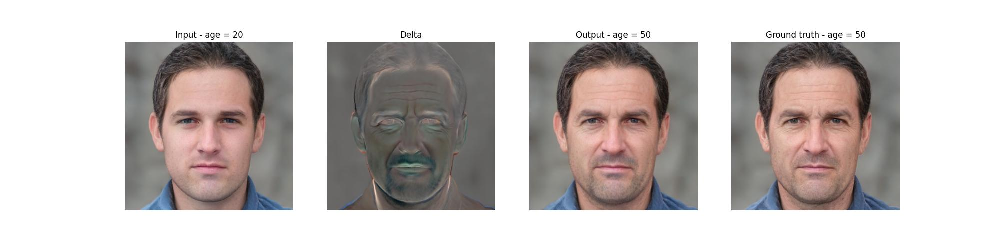
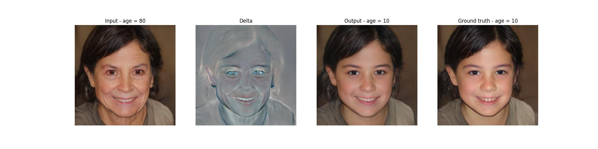

# VISAGE: Visual Ageing Generation

VISAGE is a project heavily inspired by [FRAN (Face Re-Aging Network)](https://studios.disneyresearch.com/2022/11/30/production-ready-face-re-aging-for-visual-effects/), designed to modify the apparent age of faces in images and videos. It uses a U-Net architecture for frame-by-frame age transformation, providing a tool for visual effects in media without extensive manual editing. VISAGE aims to facilitate age alteration in visual content, supporting both aging and de-aging effects efficiently.

<a href="https://opensource.org/license/apache-2-0"></a>


## How does it work?
VISAGE is trained to take in an image of a face, an input age and an output age, and produce a 'delta' which is added to the original image to create the ageing effect. Unlike many GAN based methods of style (age) transfer, the face does not have to be encoded into a latent space representation, something which often distorts the identity of the subject. VISAGE is able to perform both **ageing and deageing**:

<p align="center">

</p>

<p align="center">

</p>

## Use in video
Because VISAGE inherently preserves the identity of the subject, we can use it for multiple different frames of a video sequence:

https://github.com/cassianlewis/VISAGE/assets/131266258/bb2601e6-1fd2-45d8-a1ec-52b500fe1578


## Table of Contents
  * [Getting Started](#getting-started)
    + [Prerequisites](#prerequisites)
    + [Installation](#installation)
  * [Pretrained Models](#pretrained-models)
  * [Training](#training)
    + [Preparing your Data](#preparing-your-data)
    + [Training VISAGE](#training-visage)
    + [Additional Notes](#additional-notes)


## Getting Started
### Prerequisites
- Linux or macOS
- NVIDIA GPU is preferable, but inference will also run on your CPU (at a rate of approx 0.25 frames/s)
- Python 3

### Installation
- Dependencies:  
It is recommended to create a virtual environment to run this.
You can install the requirements by running `pip install requirements.txt`

## Pretrained Models
Please download the pretrained aging model from the following link.

| Path | Description
| :--- | :----------
|[VISAGE](https://drive.google.com/file/d/1zJsFYTAV5Oa-kEw71Id-Zx5UT-WxQjLn/view?usp=sharing)  | Trained VISAGE generator.

You can run this code to download it to the right place:

```
mkdir pretrained_models
pip install gdown
gdown "https://drive.google.com/file/d/1zJsFYTAV5Oa-kEw71Id-Zx5UT-WxQjLn/view?usp=sharing" --fuzzy -O pretrained_models/generator.pt
```

## Training
### Preparing your Data
Prepare your data according to the schema of `data/example`. Further instructions on how to download and/or create a dataset can be found in the `data` README.

### Training VISAGE
The main training script can be found in `scripts/train.py`.   
Intermediate training results are saved to `args.exp_dir`. This includes checkpoints and other training outputs (losses, intermediate images). 

If you want to train your own model, it is recommended to initialise the generator with the provided model via the `--model_path_gen` flag. This is because the pretrained model has already learnt useful representations which can aid/speed up the training of your own model. 


Training VISAGE can be achieved via this command:

```
python scripts/train.py \
--epochs=10 \
--batch_size=4 \
--model_path_gen=path/to/generator \
--data_path=path/to/data \
--exp_dir=experiments \
```

